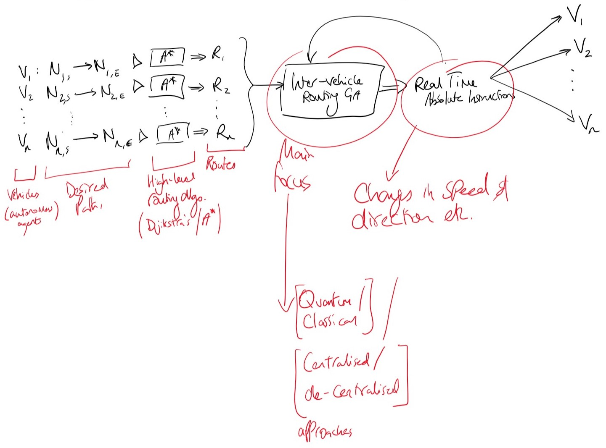

I have more thoroughly read through a few chapters (6,13,14) of the book _'On-road intelligent vehicles: motion planning for intelligent transportation systems'_ by Rahul Kala. Using these chapters I have a better understanding of the overall topology of the type of system I am looking to implement. Based on this reading, a rough outline might look like:

I have also found some public github projects where visualisations are made of GAs as they learn and are applied to the problem. These could be very useful when I come to the classical implementation phase of my project.

As well as this, I have completed and submitted by project proposal.
